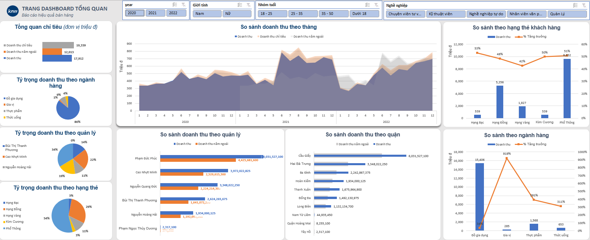

<h1 align="center">📊 KPIM Mart Excel Sales Dashboard</h1>

<h3 align="center">An interactive Excel dashboard for analyzing sales performance, revenue targets, customer segments, product categories, and store performance.</h3>

<div align="center">


</div>

---

<h1 align="center">🧾 Project Overview</h1>

KPIM Mart is a multichannel supermarket business that operates through physical stores and online sales channels. This project transforms sales, customer, product, store, promotion, and revenue target data into an interactive Excel dashboard.

The dashboard helps management monitor business performance, compare actual revenue against targets, identify sales trends, evaluate store performance, and understand customer purchasing behavior.

---

<h1 align="center">🎯 Project Objectives</h1>

- Monitor KPIM Mart's overall revenue and gross profit performance.
- Compare actual revenue with planned revenue targets.
- Measure year-over-year revenue growth.
- Identify monthly and seasonal sales trends.
- Evaluate revenue performance by store, district, and store manager.
- Analyze customer segments by membership tier, age group, gender, and occupation.
- Compare product-category performance and revenue contribution.
- Create an interactive dashboard that supports business decision-making.

---

<h1 align="center">🖼️ Dashboard Preview</h1>

<div align="center">



</div>

---

<h1 align="center">🔢 Project Data</h1>

| Metric | Value |
|:---|---:|
| Sales Transactions | 58,414 |
| Customers | 18,484 |
| Products | 353 |
| Stores | 29 |
| Promotion Programs | 16 |
| Reporting Period | January 2020 - December 2022 |
| Dashboard Charts | 9 |
| Workbook Worksheets | 15 |

---

<h1 align="center">📌 Key Performance Indicators</h1>

The dashboard tracks the following KPIs:

- **Total Revenue**
- **Revenue Target**
- **Target Completion Rate**
- **Previous-Year Revenue**
- **Year-over-Year Revenue Growth**
- **Gross Profit**
- **Quantity Sold**

---

<h1 align="center">📈 Dashboard Features</h1>

The dashboard includes the following analyses:

- Actual revenue versus target revenue
- Actual revenue versus previous-year revenue
- Monthly revenue trends
- Revenue distribution by product category
- Revenue distribution by store manager
- Revenue distribution by customer membership tier
- Revenue comparison by district
- Revenue comparison by customer segment
- Revenue and growth comparison by product category

### Interactive Filters

Users can filter the dashboard by:

- **Year**
- **Gender**
- **Occupation**
- **Age Group**

---

<h1 align="center">🗂️ Dataset Description</h1>

| Dataset | Description |
|:---|:---|
| Sales Transactions | Order dates, stores, products, promotions, customers, quantity, revenue, cost, and gross profit |
| Customers | Customer demographics, membership tier, education, occupation, age group, and purchasing history |
| Products | Product names, brands, origins, product groups, categories, selling prices, and purchase costs |
| Stores | Store names, managers, districts, and addresses |
| Promotions | Promotion names, promotion types, and discount percentages |
| Revenue Plans | Monthly revenue targets by store |
| Date Table | Daily, monthly, quarterly, and yearly time dimensions |

---

<h1 align="center">🧹 Data Preparation</h1>

The following data preparation steps were completed before building the dashboard:

- Retrieved customer information using customer phone numbers.
- Matched product identifiers with product names, prices, and purchase costs.
- Connected promotion programs with their corresponding discount rates.
- Standardized dates and created time-based fields.
- Created customer age groups for segmentation.
- Calculated customer transaction counts.
- Calculated cumulative customer spending and generated profit.
- Organized the source data into structured Excel tables.
- Created PivotTables to support dashboard charts and KPIs.
- Connected slicers to relevant PivotTables for interactive filtering.

---

<h1 align="center">🧮 Calculated Metrics</h1>

```text
Total Sales = Quantity × Selling Price

Discount Amount = Total Sales × Discount Rate

Net Revenue = Total Sales - Discount Amount

Cost of Goods Sold = Quantity × Purchase Cost

Gross Profit = Net Revenue - Cost of Goods Sold

Target Completion Rate = Actual Revenue ÷ Target Revenue

Revenue Growth = (Current Revenue - Previous Revenue) ÷ Previous Revenue
```

---

<h1 align="center">🛠️ Tools and Excel Skills</h1>


- Microsoft Excel
- Excel Tables
- PivotTables
- PivotCharts
- Slicers
- Excel Data Model
- Conditional Formatting
- Data Validation
- Dashboard Design
- Business Data Analysis
- Data Visualization
- SQL Server exported data

### Excel Functions Used

```text
VLOOKUP
XLOOKUP
INDEX
MATCH
IF
IFERROR
SUMIF
COUNTIF
DATEDIF
EOMONTH
```

---

<h1 align="center">📑 Workbook Structure</h1>

| Worksheet | Purpose |
|:---|:---|
| Dashboard | Interactive executive-level sales dashboard |
| Report | Detailed business and store performance report |
| Analysis | Revenue calculations and period comparisons |
| Pivot | PivotTables supporting dashboard visualizations |
| Data Dictionary | Definitions of fields and data types |
| Bán Hàng | Main sales transaction table |
| Kế Hoạch | Monthly revenue target data |
| Khách Hàng | Customer information and segmentation |
| Khuyến Mãi | Promotion and discount information |
| Sản Phẩm | Product and category information |
| Cửa Hàng | Store, district, and manager information |
| Thời Gian | Date dimension used for time analysis |

---

<h1 align="center">💡 Key Business Insights</h1>

The dashboard can be used to answer questions such as:

- Did KPIM Mart achieve its revenue target?
- Which stores and districts generated the highest revenue?
- Which store managers oversaw the strongest-performing locations?
- Which product categories contributed the most revenue?
- Which categories experienced positive or negative year-over-year growth?
- Which customer membership tiers generated the most revenue?
- How did monthly sales performance change between 2020 and 2022?
- Which customer segments contributed the most to company performance?

> Replace this section with three to five specific findings from the final dashboard before publishing the project.

---

<h1 align="center">▶️ How to Use the Dashboard</h1>

1. Download the Excel workbook from this repository.
2. Open `KPIM Mart Data.xlsx` in Microsoft Excel.
3. Navigate to the `Dashboard` worksheet.
4. Use the slicers to filter the dashboard by year, gender, occupation, or age group.
5. Review revenue, target, historical, customer, product, and store performance.
6. Clear the slicers to return to the complete dataset.
7. Refresh the PivotTables if the source data is updated.

---

<h1 align="center">📁 Repository Structure</h1>

```text
KPIM-Mart-Excel-Dashboard/
│
├── KPIM Mart Data.xlsx
├── README.md
│
└── images/
    └── kpim-mart-dashboard.png
```

---

<h1 align="center">⚠️ Project Limitations</h1>

- The dataset only covers the period from 2020 through 2022.
- The project uses historical or training data rather than a live operational database.
- The workbook does not currently have a live connection to SQL Server.
- New data may require refreshing formulas, PivotTables, PivotCharts, and slicers.
- Customer age values calculated using the current date may change over time.
- The dashboard focuses primarily on descriptive analysis rather than predictive modeling.

---

<h1 align="center">🚀 Future Improvements</h1>

- Connect the workbook directly to SQL Server.
- Automate data cleaning and transformation with Power Query.
- Add profit-margin analysis by store and product category.
- Add promotion-effectiveness analysis.
- Measure customer retention and repeat-purchase behavior.
- Add revenue forecasting.
- Add more detailed customer segmentation.
- Rebuild the dashboard in Power BI for automated refresh and online publishing.

---

<h1 align="center">👩‍💻 Author</h1>

<div align="center">

### Annie Nguyen

Business Analytics and Economics Student  
Gonzaga University

[](YOUR_GITHUB_PROFILE_URL)
[](YOUR_LINKEDIN_PROFILE_URL)
[](YOUR_PORTFOLIO_URL)

</div>

---

<div align="center">

⭐ If you found this project useful, consider giving the repository a star.

</div>